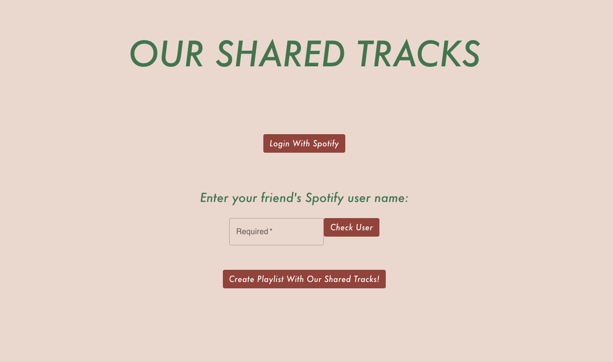
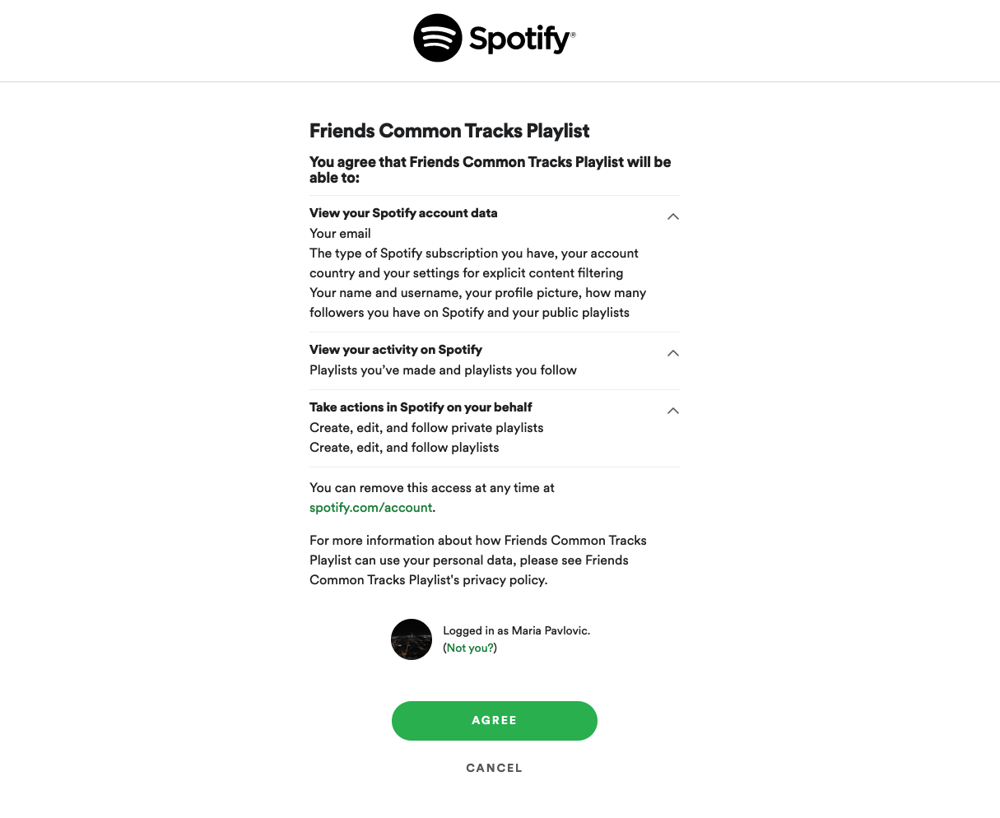
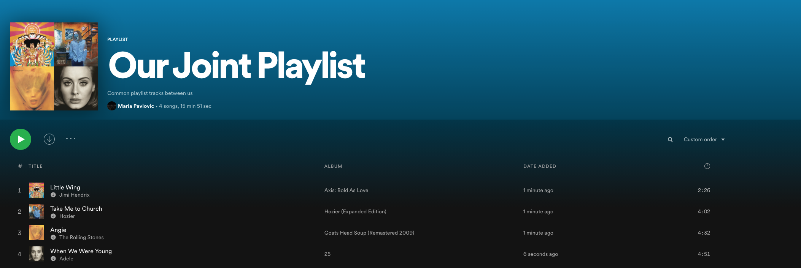

# spotify-playlist-common-songs

This is a web app that uses the Spotify API to allow a user to automatically create a playlist containing common songs between their own playlists and their friends (or any valid inputted Spotify user).

The home page first looks like this, the first step being to log in to Spotify in order to gain access to your account.

Ignore the weird formatting of the submit button, I'm working on that!

Click "Log in to Spotify"

After logging in and inputting a valid user name, you can click the button to create a playlist with "our shared tracks!" and you should see the newly created playlist on your Spotify account immediately.

Some things I want to add: disabling buttons until the previous step is done, possibly choosing which of your playlists to include in the search for common songs. 
